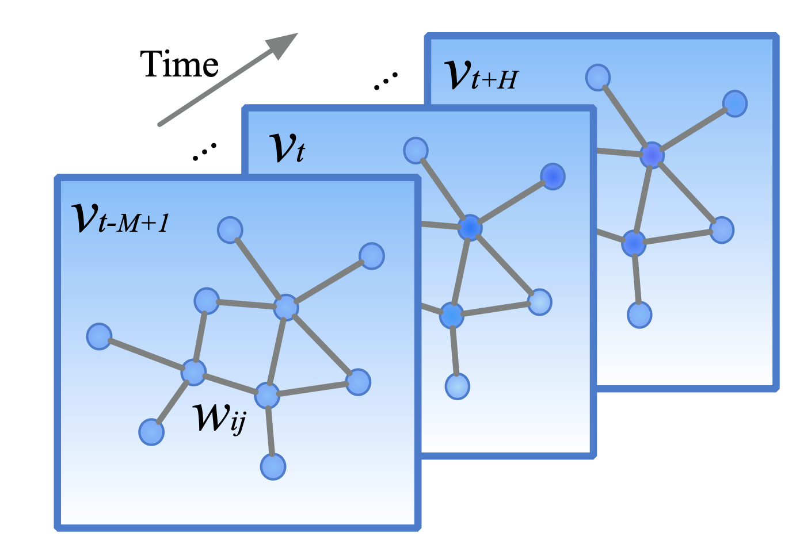
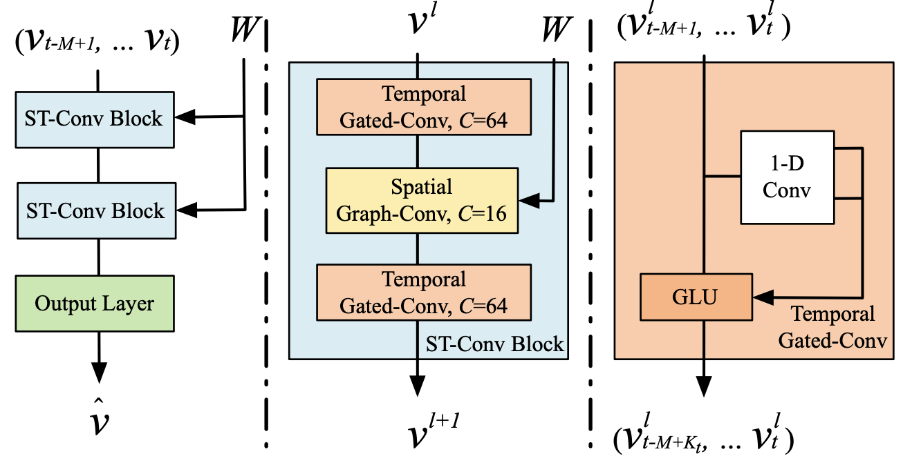

# STGCN

---

This repository provides codes and results by applying a hyper-parameter set that shows better performance using STGCN implemented by [hazdzz's](https://github.com/hazdzz/STGCN)

--- 

Forked from: [hazdzz/STGCN](https://github.com/hazdzz/STGCN)

---

## Overview

---

+ Spatio Temporal Data Mining(STDM) has considered two types of domain features. One is the spatial domain and the other one is the temporal domain. Previous works didn't consider spatial domain(e,g, Support vector machine, k-nearest neighbors algorithm, neural networks, etc). Especially, Recurrent neural networks(RNN) is many uses for widespread time series prediction like traffic prediction. But, it also does not consider the spatial domain and has very complicated. Hence, the spatio-temporal graph convolution networks(STGCN) proposed a prediction model which considers the spatial domain and the temporal domain using graph convolution and 1d convolution. 

+ [STGCN](https://arxiv.org/abs/1709.04875) are constructed with 3 layers into one block which has 2 temporal layers, 1 spatial layer, and an output layer. 

+ To extract temporal features in each node. It uses 1d convolution with a GLU unit that prevents overfitting. Hence, the temporal convolution is as follows

  $$\Gamma * \tau Y = P \bigodot \sigma(Q) \in \mathbb{R}^{(M-K_t +1)\times C_o}$$

+ To extract spatial features in a graph structure for each time step, it uses graph convolution networks(GCN) with a graph Fourier basis. However, the time complexity of GCN is $O(n^2)$. So, For extracting spatial features needs approximation strategies. One is the Chebyshev polynomials approximation and the other one is the 1st-order approximation. In the paper, Chebyshev polynomial approximation has good performance than the 1st-order approximation. So, graph convolution with the Chebyshev polynomials approximation for extracting spatial features as follows

  $$\Theta * gx = \Theta(L)x \approx \sum_{k=0}^{K-1} \theta_k T_k (\tilde{L})x$$

  and graph convolutions can be generalized as follows

  $$y_j = \sum_{i=1}^{C_i}\Theta_{i,j}x_j \in \mathbb{R}^n, \  1 \le j \le C_o $$

+ The block of STGCN is constructed with the two above extracting strategies as follows

  $$v^{l+1} = \Gamma_1^l * \tau ReLU(\Theta^l * g(R_0^l * \tau v^l))$$.

  + First, input through the first temporal layer and then extract spatial features in the spatial layer. And finally, through a second temporal layer and output layer.

## Requirements

---
+ numpy == 1.23.5 
+ pandas == 1.3.5 
+ torch(CUDA) == 1.13.1

## Dataset

---

+ Pems-Bay

  | node | observations | collecting duration          |
  | ---- | ------------ | ---------------------------- |
  | 325  | 52115        | Jan 1st 2017 ~ May 31th 2017 |

+ METR-LA

  | node | observations | collecting duration             |
  | ---- | ------------ | ------------------------------- |
  | 207  | 34271        | March 1st 2012 ~ June 30th 2012 |

+ Pemsd7-m

  | node | observations | collecting duration           |
  | ---- | ------------ | ----------------------------- |
  | 228  | 12671        | May 1st 2012 ~ June 29th 2012 |

## Found a Hyper-parameter set using Grid search

__The set of original hyper-parameter set__ 

  | Parameter         | value  |
  | ----------------- | ------ |
  | Chebyshev Kernel  | 3      |
  | Step Size         | 15     |
  | Gamma             | 0.95   |
  | Weight Decay Rate | 0.0005 |

__A set of found hyper-parameter set__

  | Parameter         | value |
  | ----------------- | ----- |
  | Chebyshev Kernel  | 5     |
  | Step Size         | 15    |
  | Gamma             | 0.95  |
  | Weight Decay Rate | 0.005 |

## Results 
__Result of original__

  | Metric | Value      |
  | ------ | ---------- |
  | MSE    | 0.493859   |
  | MAE    | 4.972343   |
  | RMSE   | 8.292414   |
  | WMAPE  | 0.08557318 |

__Result of applied with found hyper-parameters__

  | Metric | Value (Change rate) |
  | ------ | ------------------- |
  | MSE    | 0.469314 (-4.97%)   |
  | MAE    | 4.768350 (-4.10%)   |
  | RMSE   | 8.018380 (-3.30%)   |
  | WMAPE  | 0.08206249 (-4.09%) |

---

## Demo

---

You can run the grid search in this repository, entering the following code in your terminal

~~~ bash
python3 gridsearch.py
~~~

## References

---

> __Papers__
>
> + [Spatio-Temporal Graph Convolutional Networks: A Deep Learning Framework for Traffic Forecasting](https://arxiv.org/abs/1709.04875)

> __GitHub Repositories__
>
> + [STGCN_IJCAI-18;VeritasYin](https://github.com/VeritasYin/STGCN_IJCAI-18)
> + [STGCN;hazdzz](https://github.com/hazdzz/STGCN/commits?author=hazdzz)
> + [STGCN-PyTorch;Aguin](https://github.com/Aguin/STGCN-PyTorch)
